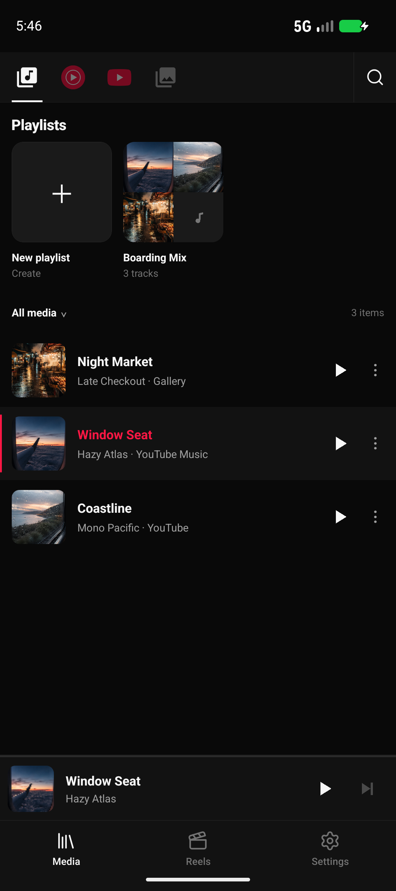
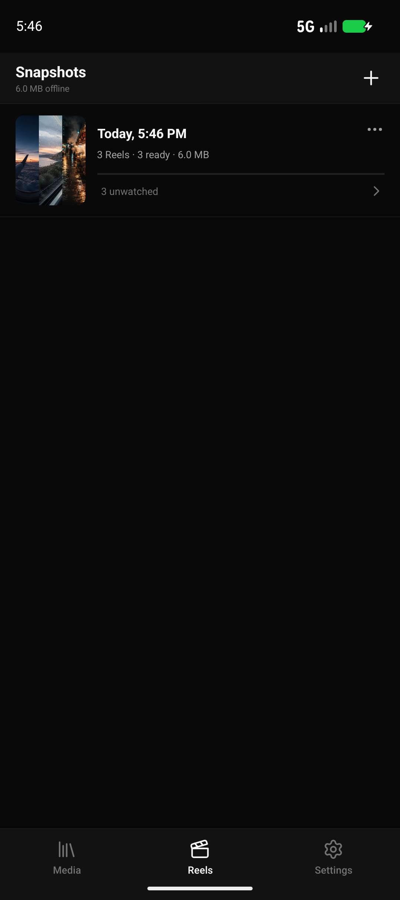
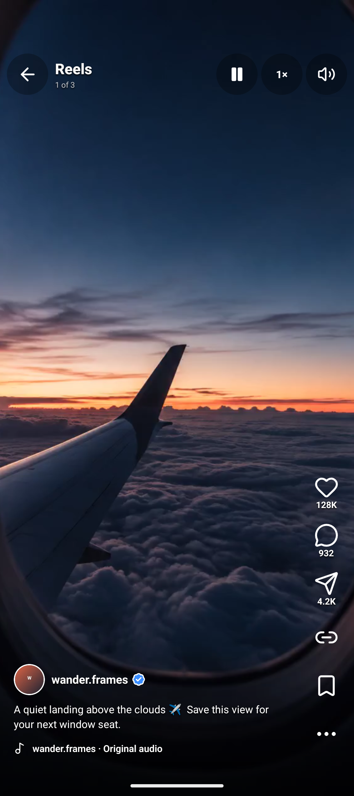
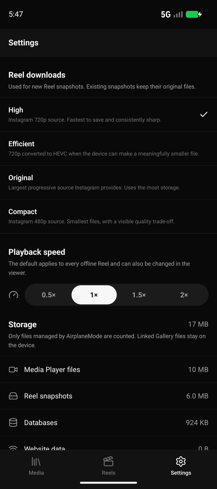

<p align="center">
  
</p>

<h1 align="center">AirplaneMode</h1>

<p align="center"><strong>Take the feed with you.</strong></p>

<p align="center">
  Save music, videos, and a personal Reel queue before takeoff, then enjoy them in one calm, offline-first Android app.
</p>

<p align="center">
  <a href="https://github.com/jatin-dot-py/AirplaneMode/releases/download/v1.0.0/AirplaneMode-1.0.0.apk"><strong>Download AirplaneMode 1.0.0 for Android</strong></a><br />
  <sub>Android 7.0+ · 50.1 MiB</sub>
</p>

> [!IMPORTANT]
> AirplaneMode is an independent project and is not affiliated with, endorsed by, or sponsored by Instagram, Meta, Google, or YouTube. Only download content you are entitled to access and retain, and follow the applicable services' terms.

## A pocket-sized offline cabin

| Media library | Reel snapshots |
| --- | --- |
|  |  |
| **Offline Reel player** | **Storage controls** |
|  |  |

## What it does

- **Media** — browse YouTube or YouTube Music inside an isolated WebView, import local files, download playable media, organize playlists, and listen through a native Media3 player with speed control, background playback, fullscreen video, and picture-in-picture.
- **Reel snapshots** — sign in to Instagram in its own WebView, navigate normally to Reels, and explicitly start a capture. AirplaneMode saves the feed order, useful metadata, covers, avatars, and playable video for later.
- **A genuinely offline feed** — reopen a snapshot without a network connection and continue from the first substantially unwatched Reel. Scroll upward whenever you want to revisit earlier items.
- **Storage you control** — see how much Media and Reels use, then clear either library, website cache/data, or everything from the Settings tab.
- **Quality choices** — choose High (up to 720p), Efficient, Original, or Compact (up to 480p) before starting a snapshot.

## How Reel capture works

1. Open **Reels**, then choose **New snapshot**.
2. Sign in to Instagram if needed. AirplaneMode never asks for or exports your password.
3. Navigate to Reels yourself and swipe once if Instagram has not emitted a pagination request yet.
4. Tap **Start fetching**. Captured batches are acknowledged only after local persistence succeeds.
5. Tap **Stop fetching** whenever the queue is large enough. Already queued downloads continue in the background.
6. Open the snapshot later—even in airplane mode.

Cookies and request credentials stay inside the WebView. The local database deliberately excludes cookies, CSRF/session values, request headers/bodies, tracking tokens, DASH manifests, and complete GraphQL responses.

## Architecture

AirplaneMode uses React Native and TypeScript for navigation and screens, with Android-native Kotlin components for the work that benefits from platform control:

- Room databases for Media and Reel snapshot state
- WorkManager queues for restart-safe downloads
- Media3 for playback, validation, transformation, and media sessions
- A document-start WebView bridge for structural Reel response detection
- App-private storage for downloaded files

Android is the production target. The iOS scaffold does not yet provide feature parity.

## Download

Download [AirplaneMode-1.0.0.apk](https://github.com/jatin-dot-py/AirplaneMode/releases/download/v1.0.0/AirplaneMode-1.0.0.apk), allow installation from your browser or Files app when Android asks, and open AirplaneMode.

## Build it yourself

Requirements: Node.js 22+, Android Studio/JDK 17, the Android SDK, and an emulator or Android 7.0+ device.

```sh
npm install
npm run verify
npm run android:preview
```

The preview APK is written to:

```text
android/app/build/outputs/apk/preview/app-preview.apk
```

The preview variant is debug-signed and uses the separate package ID `com.airplanemode.preview`. Anyone producing their own public build can configure Android signing with `android/keystore.properties.example` and run `npm run android:release`.

## Verification

```sh
npm run verify
cd android
./gradlew testDebugUnitTest assemblePreview
```

Android instrumentation tests cover persistence, downloads, media validation, paging/player lifecycles, and synthetic publish/stress fixtures. Manual acceptance still requires a physical-device pass with fresh service accounts before a public release.

## Current limitations

- Signed media URLs can expire before a queued download completes; failed files remain retryable.
- Service-side WebView and private endpoint changes can break capture or media resolution without an app update.
- Reel comments and online mutations such as liking, sharing, following, or saving are intentionally not reproduced offline.
- Third-party services can change their pages, endpoints, or terms independently of this project.
